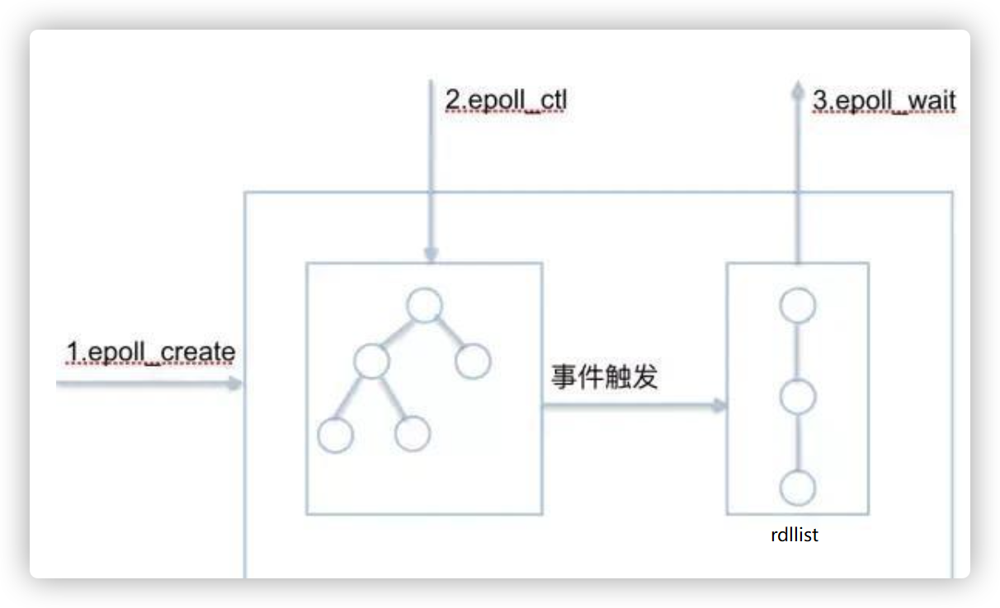
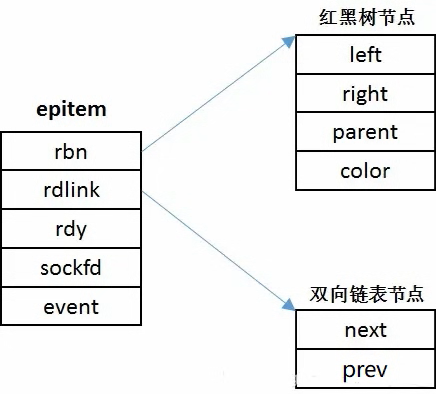
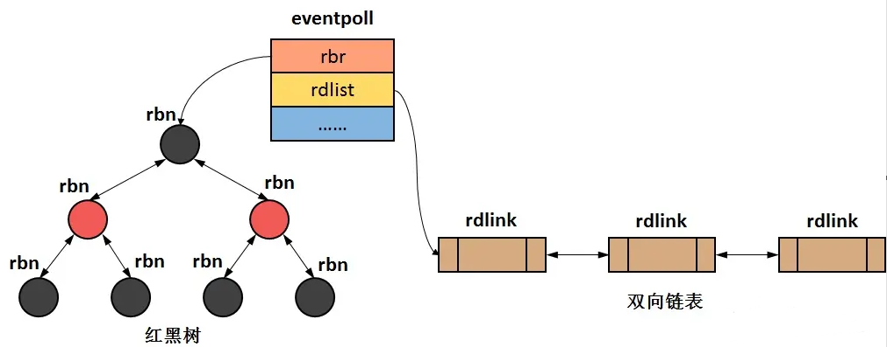

# Epoll 的基础知识
### 概念
epoll是I/O多路复用的一种。I/O 多路复用的本质，是通过一种机制（系统内核缓冲I/O数据），让`单个进程可以监视多个文件描述符，一旦某个描述符就绪（一般是读就绪或写就绪），能够通知程序进行相应的读写操作`。

------------------------------
### epoll核心
`1个红黑树`（索引结构），`1个双向链表`（就绪队列），`3个API`，具体如下图:\

------------------------------
### 就绪队列
就绪列表引用着`就绪的socket`，所以它应能够快速的插入数据。程序可能随时调用epoll_ctl添加监视socket，也可能随时删除。当删除时，若该socket已经存放在就绪列表中，它也应该被移除。（事实上，每个`epoll_item`既是红黑树节点，也是链表节点，删除红黑树节点，自然删除了链表节点）所以就绪列表应是一种能够快速插入和删除的数据结构。双向链表就是这样一种数据结构，epoll使用双向链表来实现就绪队列（对应上图的rdllist）。

------------------------------
### epoll索引结构
既然epoll将“维护监视队列”和“进程阻塞”分离，也意味着需要有个数据结构来保存监视的socket。至少要方便的添加和移除，还要便于搜索，以避免重复添加。红黑树是一种自平衡二叉查找树，搜索、插入和删除时间复杂度都是O(log(N))，效率较好。epoll 使用了`红黑树`作为索引结构。

------------------------------
### epitem
\
如图所示，epitem是中包含了两个主要的成员变量，分别是 `rbn` 和 `rdlink`，前者是红黑树的节点，而后者是双链表的节点，也就是说一个epitem对象即可作为红黑树中的一个节点又可作为双链表中的一个节点。并且每个epitem中存放着一个event（`epoll_event结构`），对event的查询也就转换成了对epitem的查询。

------------------------------
### eventpoll（epoll）
\
如图所示，eventpoll中包含了两个主要的成员变量，分别是rbr和rdlist，前者指向红黑树的`根节点`，后者指向双链表的`头结点`。即`一个eventpoll对象对应二个epitem的容器`。对epitem的检索，将发生在这两个容器上（红黑树和双链表）。

------------------------------
### 总结
epoll底层实现中有两个关键的数据结构，一个是`eventpoll`另一个是`epitem`，其中`eventpoll中有两个成员变量分别是rbr和rdlist`,前者指向一颗红黑树的根，后者指向双向链表的头。而`epitem则是红黑树节点和双向链表节点的综合体`，也就是说epitem即可作为树的节点，又可以作为链表的节点，并且epitem中包含着用户注册的事件。

>* 当用户调用epoll_create()时，会创建eventpoll对象（包含一个`红黑树`和一个`双链表`）；
>* 而用户调用epoll_ctl(ADD)时，会在红黑树上增加节点（epitem对象）；
>* 接下来，操作系统会默默地在通过`epoll_event_callback()`来管理eventpoll对象。当有事件被触发时，操作系统则会调用epoll_event_callback函数，将含有该事件的epitem添加到`双向链表`中。
>* 当用户需要管理连接时，只需通过epoll_wait()从eventpoll对象中的`双链表`下"摘取"epitem并取出其包含的事件即可。